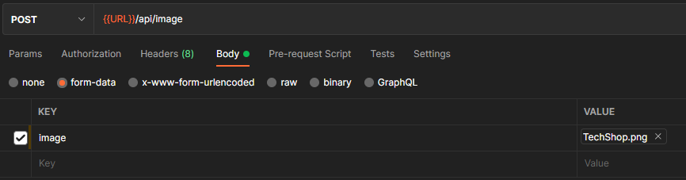

# portfolio-v3

## Description:

[www.greywhitt.com](www.greywhitt.com)

This is the third version of my portfolio featuring a fully custom front-end, back-end, and AWS S3 image hosting. The front-end was built in react, featuring custom styles using [styled-components](https://styled-components.com/). I built an express server to serve data from my Postgres database so I can change, add, and update all of the text and images you see without having to take the site offline.

Checkout the [first](https://github.com/Grey-Whitt/Grey-Whitt.github.io) and [second](https://github.com/Grey-Whitt/react-portfolio) versions I build while I was in school!

# Table of Contents

- [Repository](#repository)
- [Examples](#examples)
- [Usage](#usage)
- [Technologies Used](#technologies-used)
- [Questions](#questions)
- [Contributions](#contributing)
- [License](#license)

## Repository:

---

- [My Github Profile](https://github.com/Grey-Whitt)

- [This Repository](https://github.com/Grey-Whitt/portfolio-v3)

- [Deployed Application](www.greywhitt.com)

## Examples

---

This is and example of a response to the GET /api/profile route.
```
{
    "id": 1,
    "firstName": "Grey",
    "lastName": "Whittenberger",
    "email": "greywhitt@gmail.com",
    "phoneNumber": "5125396139",
    "location": "Austin, TX",
    "bio": "lorem ipsum delor sit amet...",
    "linkedin": "https://www.linkedin.com/in/grey-whittenberger/",
    "github": "https://github.com/Grey-Whitt",
    "resume": "https://docs.google.com/document/d/1IPc3pfCwKi05HY9mwiKjdBnhO4lMVlLw-D6PNHYssdU/preview",
    "createdAt": "2022-05-26T03:20:42.294Z",
    "updatedAt": "2022-05-26T03:20:42.294Z",
    "Skills": [
        {
            "skillName": "Node",
            "type": "backend",
            "profileId": 1
        },
       
        {
            "skillName": "React",
            "type": "frontend",
            "profileId": 1
        },
    ]
}
```   
  
This is what a POST request to /api/skills looks like 
```
// Body of request 
{
    "skillName": "CSS",
    "type": "frontend",
    "profileId": 1
}


// Returned data
{
    "id": 16,
    "skill_name": "CSS",
    "type": "frontend",
    "profile_id": 1,
    "updatedAt": "2022-05-27T00:19:32.775Z",
    "createdAt": "2022-05-27T00:19:32.775Z"
}

```
  
This is an example of a POST to /api/projects
```
{
    "title": "Tech Shop",
    "description": "TechShop is an ecommerce website using the MERN stack and Redux for state management.",
    "deployedLink": "https://merntechshop.herokuapp.com/",
    "repoLink": "https://github.com/Grey-Whitt/mern-tech-shop"
}

```

Lastly, This is how you would upload an image in Postman to the AWS S3 bucket, using form-data, setting the key to 'image", and selecting the image you want to upload. I have this set up to only accept PNGs.  


## Usage

---

### Color Palette

You can find and edit the colors in client/src/styles/theme.js
| Color | Hex |
| -------------- | ------------------------------------------------------------------ |
| grayWeb |  `#7d7f89` |
| lightGray |  `#d2d3d3` |
| davysGrey |  `#555759` |
| jet |  `#2d3032` |
| accent |  `#ff7f11` |

### ES Modules in Node

Server imports handled with ECMAScript Modules. You will need node v14.6^ or higher to run this project.

### Env Variables

Create a .env file in the root with following variables

```
Database Info
DB_NAME=name
DB_USER=user
DB_PW=password

AWS_BUCKET_NAME=name
AWS_BUCKET_REGION=region
AWS_ACCESS_KEY=key
AWS_SECRET_KEY=key

EMAIL=your@email.com
EMAIL_PW=email password (create a google app password)

NODE_ENV = development
PORT = 5000
```

### Install Dependencies (client & server)

This project uses yarn

```
yarn install
cd client
yarn install
```

### Run

```
# Run client (:3000) & server (:5000)
yarn dev

# Run backend only
yarn server
```

## Build & Deploy

```
# Create frontend production build
cd client
yarn build
```

There is a Heroku postbuild script, so if you push to Heroku, no need to build manually for deployment.

## Technologies Used

---

React  
Node.js  
React Router v6  
SCSS  
Postgres  
Sequelize  
Multer  
AWS S3  
Nodemailer  
Deployed with Heroku  
Database hosted on Heroku Postgres

## Questions

---

If you have any questions feel free to email me or find me on LinkedIn

[greywhitt@gmail.com](mailto:greywhitt@gmail.com)

[My LinkedIn](https://www.linkedin.com/in/grey-whittenberger)

[www.greywhitt.com](www.greywhitt.com)

## Contributing:

---

[](./uploads/CODE_OF_CONDUCT.md)

Contributions, issues and feature requests are welcome.

## License:

---


Copyright 2022 Grey Whittenberger

Permission is hereby granted, free of charge, to any person obtaining a copy of this software and associated documentation files (the "Software"), to deal in the Software without restriction, including without limitation the rights to use, copy, modify, merge, publish, distribute, sublicense, and/or sell copies of the Software, and to permit persons to whom the Software is furnished to do so, subject to the following conditions:

The above copyright notice and this permission notice shall be included in all copies or substantial portions of the Software.

THE SOFTWARE IS PROVIDED "AS IS", WITHOUT WARRANTY OF ANY KIND, EXPRESS OR IMPLIED, INCLUDING BUT NOT LIMITED TO THE WARRANTIES OF MERCHANTABILITY, FITNESS FOR A PARTICULAR PURPOSE AND NONINFRINGEMENT. IN NO EVENT SHALL THE AUTHORS OR COPYRIGHT HOLDERS BE LIABLE FOR ANY CLAIM, DAMAGES OR OTHER LIABILITY, WHETHER IN AN ACTION OF CONTRACT, TORT OR OTHERWISE, ARISING FROM, OUT OF OR IN CONNECTION WITH THE SOFTWARE OR THE USE OR OTHER DEALINGS IN THE SOFTWARE.

For more information about licenses, please visit:
[License](https://opensource.org/licenses/MIT)
